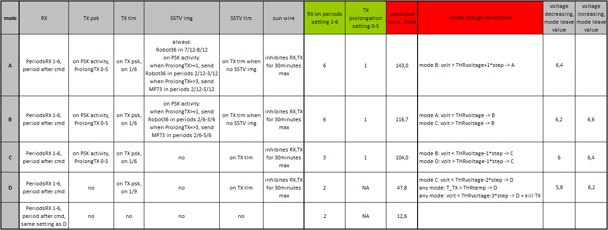

# PSAT-2 PSK/SSTV transponder

This repository hosts public parts of two boards from [PSAT2](http://www.aprs.org/psat2.html), a 2U CubeSat by US Naval Academy. These boards were developed at Dept. of Radio Electronics, Brno University of Technology, Czech Republic. The source files do not include authorization codes for SSTV and uplink commanding for PSK transponder.

**PSK transponder board** is an updated version of the PSK transponder with beacon and telemetry, used on [PSAT](http://www.aprs.org/psat.html) and [BRICSAT-1](http://www.aprs.org/bricsat-1.html). Transponder documentation available for [PSAT](http://www.urel.feec.vutbr.cz/esl/files/Projects/PSAT/P%20sat%20transponder%20WEB%20spec02.htm) and [BRICSAT-1](http://www.urel.feec.vutbr.cz/esl/files/Projects/BRICsat/Bricsat%20transponder%20WEB%20spec02.htm).

**SSTV transmitter board** provides a Slow-scan Television (SSTV) signal generator with PSK/CW telemetry, APRS uplink, and camera module. It is based on STM32F446RET6 microcontroller. Supported SSTV modes are Robot36, Robot72, MP73 and MP115.

## Important links (UPDATED!)

* [Gallery of decoded SSTV images](http://www.urel.feec.vutbr.cz/esl/psat2/sstv/)

* [Online telemetry decoder](http://www.urel.feec.vutbr.cz/esl/psat2/psat2tlm.php) (customised: [no_save](http://www.urel.feec.vutbr.cz/esl/psat2/tlm.php), [to_excel](http://www.urel.feec.vutbr.cz/esl/psat2/tlm2.php))

* [Decoded telemetry of PSK and SSTV boards](https://docs.google.com/spreadsheets/d/1X_4X0AgCshNDFIrDecOif41eRRwNzOKZwRn9tjI5_hs/edit?usp=sharing)

* [SatNOGS for PSAT2](https://network.satnogs.org/observations/?future=0&good=1&bad=0&unvetted=0&failed=0&norad=99969)

* Please **send your images** and report PSK-31 telemetry to alpov@alpov.net

## Transponder modes overview
The main function of the transponder is to receive PSK signals from 29.48 MHz uplink (passband from 29.4804 to 29.4826 MHz) and transmit them as a FM signal at 435.350 MHz downlink. The downlink is mixed with telemetry streams and SSTV images.

The PSK board switches between modes A to D according to available power. Battery voltage is checked periodically and after each transmitted character. If it crosses a boundary, the mode is switched. Moreover, if the voltage falls below a critical limit, the transmission is stopped immediately. This behavior can be observed in mode D, when only a part of the telemetry is transmitted.

All operations are limited to Sun detection, which is controlled by SUNWIRE signal. The SUNWIRE is fail-safe checked by state machine. After MCU reboot, the Sun signal is always high. It goes low after falling edge on SUNWIRE. If the SUNWIRE is low for more than 30 minutes, it is set to high automatically, otherwise with rising edge on SUNWIRE. Interconnects between both boards and PSAT-2 are shown [in a block diagram](Docs/psk_sstv_interconnect.png).

Communication is divided into 20sec time slots. There are 6 slots for modes A/B/C, and 9 slots for mode D. The telemetry is transmitted in every 1st slot or if PSK uplink is detected. Additionally, an SSTV image or telemetry is added to the transmitted signal. The time slots do not affect the PSK transponder function, so there is no need to fit with the PSK uplink signal into a time window. However, advanced functions such as commanding, telemetry and SSTV, are synchronized into these windows.

Users will be able to command these functions after the system has been successfully activated in space and we have completed successful checkout.

## Telemetry streams
The PSK MCU generates telemetry data in PSK31 format, which is transmitted on 435.350 MHz, carrier at 374 Hz. This telemetry consists of current and historical frame. Current frame contains frame counter, reboot counter, values of PSK level, AGC, battery voltage, 5V voltage, current, RX temperature, and several period counter values. History frame is pseudo-randomly selected from memory and contains the same information except for period counters. Example telemetry frame: *PSAT-2 C apng eFaaijtkpokoaB aaaa A aokF eEadjluappjxay*. Such frame can be [decoded with the provided PHP decoder](http://www.urel.feec.vutbr.cz/esl/psat2/psat2tlm.php). Valid telemetry frames are automatically saved for further analysis.

The other telemetry stream is generated by SSTV MCU, transmitted in PSK31 format on the same frequency, carrier at 280 Hz. Telemetry contains current state of non-persistent tick counter, measurements of MCU temperature and ambient light in lux, state of several counters (authorization, planned events, reboots, errors, audio starts, camera images, commands accepted, commands rejected, commands unauthorized). Example telemetry frame: *PSAT-2 S ashd aDbiaaaa qralaitkboFxaa*. Again, such frame can be [decoded with the provided PHP decoder](http://www.urel.feec.vutbr.cz/esl/psat2/psat2tlm.php).

## SSTV operation
SSTV MCU can be commanded through APRS commands. If no command is received during 60 seconds, it starts *auto* mode. In this mode, all transmissions are synchronized to PSK TX. SSTV board can transmit PSK telemetry or SSTV images in Robot36 and MP73 modes. Images are progressively selected alternately from ROM and FLASH. ROM images are hard-coded to firmware, while FLASH images are grabbed from on-board camera. After each reboot, first 8 images in FLASH are taken with 30sec separation.

APRS commands addressed to special callsign will change the mode to *manual*. Details on public commanding will be added after successful deployment and initial testing of the satellite.
