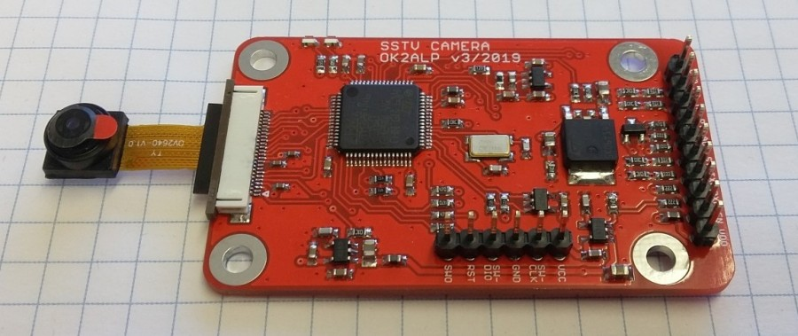

# SatCam - SSTV encoder for OV2640

SatCam in an SSTV encoder with OV2640 camera. It is based on STM32F446RET6 microcontroller. Supported SSTV modes are Robot36, Robot72, MP73 and MP115. SatCam was originally developed as a part of PSAT2 satellite project and later redesigned as a stand-alone module.

SatCam can be commanded from e.g. an APRS link, the UART works at 9600 8N1. It looks for `SATCAMERA:` keyword, followed by a command. End of line is `<CR>`, `<LF>` or `{`. Empty lines and messages without proper keyword are ignored. All commands including the keyword are case insensitive. Example: `SatCamera:sstv.live.73<CR>`.

Another way of using SatCam is to setup its initial configuration with UART and then use its input signals only.

## Pin connections
| Pin   | Description |
| ----- | ----------- |
| `M0`  | mode select (0-3)
| `M1`  | mode select (0-3)
| `PTT` | open-drain PTT output, active low during TX
| `AUD` | audio output
| `ST`  | start trigger input
| `TXD` | UART input (connected to MCU RXD)
| `RXD` | UART output (connected to MCU TXD)
| `EN`  | voltage regulator enable input
| `VDD` | power supply

## Voltage levels
| Pin   | Levels      |
| ----- | ----------- |
| `ST`, `M0`, `M1`  | 5V (can be changed with R7, R8, R9)
| `TXD`, `RXD`      | 3V3 (RXD can be changed with R3, TXD needs level converter)
| `EN`              | >2.3V enabled, <0.5V or open disabled
| `PTT`             | open-drain, max. 25V
| `AUD`             | default 90% volume is ????Vpp to high impedance (>5kohm) load
| `VDD`             | ???-16V

## Current consumption
| Mode                                              | Avg. current |
| ------------------------------------------------- | ------------ |
| disabled with EN input                            | 0.6mA
| idle, monitoring UART                             | 2.8mA
| taking picture, ~1.3 seconds before each image    | 60.6mA
| transmitting audio, with short peaks              | 10.3mA

## Tested OV2640 modules
* [AdvancedTech](https://www.aliexpress.com/item/32898143505.html): landscape, FOV ~50°, [example](Docs/ov2640_AdvancedTech.jpg)
* [Your Cee Mini](https://www.aliexpress.com/item/33058626691.html): landscape, FOV ~60°, [example](Docs/ov2640_YourCeeMini.jpg)
* [Your Cee Wide](https://www.aliexpress.com/item/33058626691.html): landscape, FOV ~120°, [example](Docs/ov2640_YourCeeWide.jpg)
* [Alice1101983](https://www.aliexpress.com/item/32978120017.html), [ModuleFans](https://www.aliexpress.com/item/33042725935.html): portrait, [example](Docs/ov2640_Alice.jpg)

## SatCam commands

UART at 9600 8N1; case insensitive, delimiter is `SATCAMERA:`, end of line is `{` or `<CR>` or `<LF>`.

| Command syntax                        | Example       | Parameters |
| ------------------------------------- | ------------- | ---------- |
| `sstv.live.MODE.OVERLAY`              | `sstv.live.36` (send picture as Robot36) | MODE is `36` for Robot36, `72` for Robot72, `73` for MP73, `115` for MP115 (default: 36)
| `sstv.rom.MODE.PAGE_NUMBER.OVERLAY`   | `sstv.rom.115.3.hello` (send hardcoded image 3 as MP115, with overlay) | PAGE_NUMBER is ROM memory page (default: 0), OVERLAY is user-defined text, `.` and `{` not allowed, up to 13 chars (default: none)
| `psk.MESSAGE.SPEED.FREQ`              | `psk.hello.31.1000` (send message as PSK-31 at 1kHz) | MESSAGE is either user-defined text (`.` and `{` not allowed) or `nvinfo` or `config`
| `psk.config.SPEED.FREQ`               | `psk.config.125.1000` (send configuration as PSK-125 at 1kHz) | SPEED is `31`, `63`, `125`, `250`, `500`, `1000` (default: 31, for config/nvinfo: 125)
| `psk.nvinfo.SPEED.FREQ`               | `psk.nvinfo.125.1000` (send NVinfo log as PSK-125 at 1kHz) | FREQ is 100-7000Hz (default: 800)
| `cw.MESSAGE.WPM.FREQ`                 | `cw.hello.25.1000` (send message as 25WPM CW at 1kHz) | WPM is word per minute speed (5 to 40)
| `auth.PIN`                            | `auth.1234` (authorize with PIN 1234) | PIN is user or master access code

| Command syntax                        | Default       | Parameters |
| ------------------------------------- | ------------- | ---------- |
| `camcfg.delay.DELAY`                  | 1000          | Camera module initial delay. DELAY is 100-5000ms.
| `camcfg.qs.QS`                        | 5             | JPEG quality factor. QS is 0-255.
| `camcfg.agc.ceiling.AGC_CEILING`      | 16            | Automatic gain control. AGC_CEILING is 2, 4, 8, 16, 32, 64, 128.
| `camcfg.agc.manual.AGC_VALUE`         | 0             | Manual gain control. AGC_MANUAL is 0-1023.
| `camcfg.aec.auto`                     |               | Automatic exposure control.
| `camcfg.aec.manual.AEC_VALUE`         | `auto`        | Manual exposure time. AEC is 0-65535 or `auto`.
| `camcfg.awb.AWB_TYPE`                 | `sunny`       | Automatic white balabce. AWB is `auto`, `sunny`, `cloudy`, `office`, `home`.
| `camcfg.rotate.ROTATE`                | off           | Camera rotation (upside down). ROTATE is `off` or `on`.
| `camcfg.start.0.COMMAND`              | `SSTV.LIVE.36`        | Command for M0=0, M1=0.
| `camcfg.start.1.COMMAND`              | `SSTV.LIVE.73`        | Command for M0=1, M1=0.
| `camcfg.start.2.COMMAND`              | `PSK.NVINFO.125.1000` | Command for M0=0, M1=1.
| `camcfg.start.3.COMMAND`              | `SSTV.ROM.115.0`      | Command for M0=1, M1=1.
| `camcfg.startedge.EDGE_VALUE`         | `any`         | Active edge for ST trigger input. EDGE_VALUE is `rising`, `falling` or `any`.
| `camcfg.callsign.CALLSIGN`            | `SatCam`      | Module callsign, for SSTV overlay and PSK/CW messages.
| `camcfg.autoreboot.REBOOT_TIME`       | 0             | Periodic reboot. REBOOT_TIME is 0 or >=120sec. Careful when uptime>autoreboot, camera will reboot immediately without savit the value.
| `camcfg.userpin.PIN`                  | 0             | Set user PIN for `camcfg` and `debug` commands.
| `camcfg.clearlog`                     |               | Clear EEPROM logs.
| `camcfg.reboot`                       |               | Safe MCU reboot (with NVIC).
| `camcfg.load`                         |               | Load configuration from EEPROM (always after power-up).
| `camcfg.save`                         |               | Save current configuration to EEPROM.
| `camcfg.default`                      |               | Load default SatCam configuration.

| Command syntax                        | Description |
| ------------------------------------- | ----------- |
| `debug.status`                        | Write status (configuration and NVinfo) to terminal.
| `debug.reset.RESET_TYPE`              | Debug MCU reset. RESET_TYPE is `nvic`, `watchdog`, `fault`.
| `debug.sendjpeg`                      | Send JPEG from camera to terminal.
| `debug.eeprom.fullerase`              | Perform full EEPROM erase (configuration and logs).
| `debug.eeprom.dump`                   | Dump configuration EEPROM page to terminal.
| `debug.adc.voltage`                   | Measure VDD voltage and write to terminal.
| `debug.adc.temp`                      | Measure core temperature and write to terminal.

